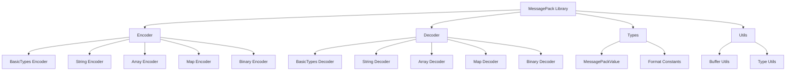

# Design Document

## Overview

The MessagePack AssemblyScript library will provide efficient binary serialization capabilities with a focus on performance and minimal memory footprint. The design follows MessagePack specification v5 and leverages AssemblyScript's WebAssembly compilation target for optimal performance.

The library will be structured as a single module with separate encoder and decoder classes, utilizing AssemblyScript's typed arrays and memory management features for efficient binary operations.

## Architecture



### Core Components

1. **MessagePackEncoder**: Main encoding class that handles serialization
2. **MessagePackDecoder**: Main decoding class that handles deserialization  
3. **MessagePackValue**: Union type representing all possible MessagePack values
4. **Buffer Management**: Efficient byte array handling utilities
5. **Format Constants**: MessagePack format type definitions

## Components and Interfaces

### MessagePackValue Type System

```typescript
// Core value types that can be serialized
type MessagePackValue = 
  | null
  | boolean
  | i8 | i16 | i32 | i64
  | u8 | u16 | u32 | u64
  | f32 | f64
  | string
  | Uint8Array
  | MessagePackValue[]
  | Map<string, MessagePackValue>;
```

### Encoder Interface

```typescript
export class MessagePackEncoder {
  private buffer: Uint8Array;
  private position: i32;
  
  constructor(initialCapacity: i32 = 1024);
  
  // Main encoding methods
  encode(value: MessagePackValue): Uint8Array;
  
  // Type-specific encoding methods
  private encodeNull(): void;
  private encodeBool(value: boolean): void;
  private encodeInt(value: i64): void;
  private encodeFloat(value: f64): void;
  private encodeString(value: string): void;
  private encodeArray(value: MessagePackValue[]): void;
  private encodeMap(value: Map<string, MessagePackValue>): void;
  private encodeBinary(value: Uint8Array): void;
  
  // Buffer management
  private ensureCapacity(needed: i32): void;
  private writeUint8(value: u8): void;
  private writeUint16BE(value: u16): void;
  private writeUint32BE(value: u32): void;
  private writeBytes(bytes: Uint8Array): void;
}
```

### Decoder Interface

```typescript
export class MessagePackDecoder {
  private buffer: Uint8Array;
  private position: i32;
  
  constructor(buffer: Uint8Array);
  
  // Main decoding method
  decode(): MessagePackValue;
  
  // Type-specific decoding methods
  private decodeValue(): MessagePackValue;
  private decodeString(length: u32): string;
  private decodeArray(length: u32): MessagePackValue[];
  private decodeMap(length: u32): Map<string, MessagePackValue>;
  private decodeBinary(length: u32): Uint8Array;
  
  // Buffer reading utilities
  private readUint8(): u8;
  private readUint16BE(): u16;
  private readUint32BE(): u32;
  private readBytes(length: u32): Uint8Array;
  private hasRemaining(bytes: i32): boolean;
}
```

### Format Constants

```typescript
// MessagePack format constants
export namespace Format {
  // Positive integers (0x00 - 0x7f)
  export const POSITIVE_FIXINT_MAX: u8 = 0x7f;
  
  // Maps (0x80 - 0x8f)
  export const FIXMAP_PREFIX: u8 = 0x80;
  export const FIXMAP_MAX: u8 = 0x8f;
  
  // Arrays (0x90 - 0x9f)  
  export const FIXARRAY_PREFIX: u8 = 0x90;
  export const FIXARRAY_MAX: u8 = 0x9f;
  
  // Strings (0xa0 - 0xbf)
  export const FIXSTR_PREFIX: u8 = 0xa0;
  export const FIXSTR_MAX: u8 = 0xbf;
  
  // Nil, boolean
  export const NIL: u8 = 0xc0;
  export const FALSE: u8 = 0xc2;
  export const TRUE: u8 = 0xc3;
  
  // Binary data
  export const BIN8: u8 = 0xc4;
  export const BIN16: u8 = 0xc5;
  export const BIN32: u8 = 0xc6;
  
  // Floats
  export const FLOAT32: u8 = 0xca;
  export const FLOAT64: u8 = 0xcb;
  
  // Unsigned integers
  export const UINT8: u8 = 0xcc;
  export const UINT16: u8 = 0xcd;
  export const UINT32: u8 = 0xce;
  export const UINT64: u8 = 0xcf;
  
  // Signed integers
  export const INT8: u8 = 0xd0;
  export const INT16: u8 = 0xd1;
  export const INT32: u8 = 0xd2;
  export const INT64: u8 = 0xd3;
  
  // Strings
  export const STR8: u8 = 0xd9;
  export const STR16: u8 = 0xda;
  export const STR32: u8 = 0xdb;
  
  // Arrays
  export const ARRAY16: u8 = 0xdc;
  export const ARRAY32: u8 = 0xdd;
  
  // Maps
  export const MAP16: u8 = 0xde;
  export const MAP32: u8 = 0xdf;
  
  // Negative integers (0xe0 - 0xff)
  export const NEGATIVE_FIXINT_MIN: u8 = 0xe0;
}
```

## Data Models

### Buffer Management Strategy

The encoder uses a growable buffer strategy:
- Initial capacity of 1KB (configurable)
- Doubles capacity when more space is needed
- Tracks current position for efficient writing
- Returns a trimmed buffer containing only the encoded data

### Integer Encoding Strategy

MessagePack uses variable-length integer encoding:
- Positive integers 0-127: Single byte (0x00-0x7f)
- Negative integers -32 to -1: Single byte (0xe0-0xff)  
- Other integers: Use smallest possible format (int8, int16, int32, int64)
- Unsigned integers: Use smallest possible format (uint8, uint16, uint32, uint64)

### String Encoding Strategy

Strings are encoded as UTF-8 bytes with length prefix:
- Length 0-31: fixstr format (0xa0 + length)
- Length 32-255: str8 format (0xd9 + 1-byte length)
- Length 256-65535: str16 format (0xda + 2-byte length)
- Length 65536+: str32 format (0xdb + 4-byte length)

### Collection Encoding Strategy

Arrays and maps use similar length-prefixed formats:
- Small collections use "fix" formats for efficiency
- Larger collections use 16-bit or 32-bit length prefixes
- Elements are encoded recursively using the same encoding rules

## Error Handling

### Encoding Errors

```typescript
export class MessagePackEncodeError extends Error {
  constructor(message: string) {
    super(`MessagePack encode error: ${message}`);
  }
}
```

Common encoding error scenarios:
- Unsupported data types
- Buffer allocation failures
- Integer overflow conditions

### Decoding Errors

```typescript
export class MessagePackDecodeError extends Error {
  constructor(message: string) {
    super(`MessagePack decode error: ${message}`);
  }
}
```

Common decoding error scenarios:
- Invalid format bytes
- Truncated data (insufficient bytes)
- Invalid UTF-8 sequences in strings
- Nested depth limits exceeded

### Error Recovery Strategy

- Fail fast on invalid input
- Provide detailed error messages with position information
- No partial decoding - either succeed completely or fail cleanly
- Memory cleanup on error conditions

## Testing Strategy

### Unit Testing Approach

1. **Format Compliance Tests**
   - Test each MessagePack format type individually
   - Verify byte-level output matches specification
   - Test boundary conditions (min/max values)

2. **Round-trip Tests**
   - Encode then decode values, verify equality
   - Test with various data combinations
   - Verify no data loss occurs

3. **Edge Case Tests**
   - Empty collections (arrays, maps, strings)
   - Maximum size collections
   - Nested data structures
   - Unicode string handling

4. **Performance Tests**
   - Memory usage profiling
   - Encoding/decoding speed benchmarks
   - Large data set handling

5. **Error Condition Tests**
   - Invalid input handling
   - Malformed MessagePack data
   - Buffer overflow scenarios

### Integration Testing

- Cross-platform compatibility with other MessagePack implementations
- WebAssembly runtime testing
- Memory leak detection in long-running scenarios

### Test Data Strategy

- Use official MessagePack test vectors where available
- Generate comprehensive test cases covering all format types
- Include real-world data patterns (JSON-like structures)
- Test with binary data of various sizes

## Performance Considerations

### Memory Optimization

- Use typed arrays for efficient binary operations
- Minimize object allocations during encoding/decoding
- Reuse buffers where possible
- Implement buffer pooling for frequent operations

### CPU Optimization

- Avoid unnecessary type conversions
- Use bit operations for format detection
- Minimize function call overhead in hot paths
- Leverage AssemblyScript's SIMD capabilities where applicable

### WebAssembly Specific Optimizations

- Minimize imports/exports for smaller binary size
- Use linear memory efficiently
- Avoid JavaScript interop in performance-critical paths
- Optimize for WebAssembly's stack-based execution model